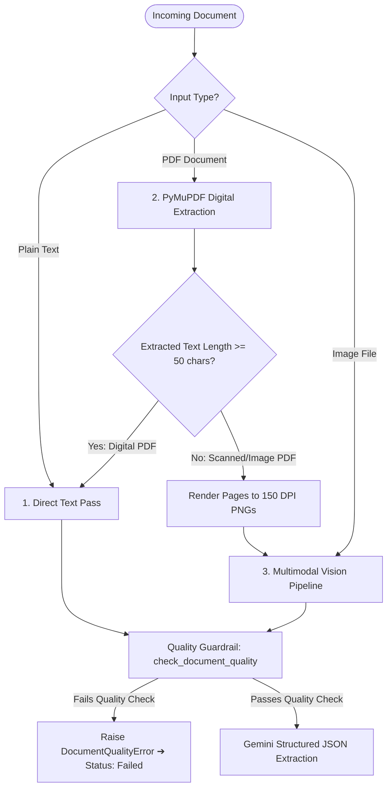
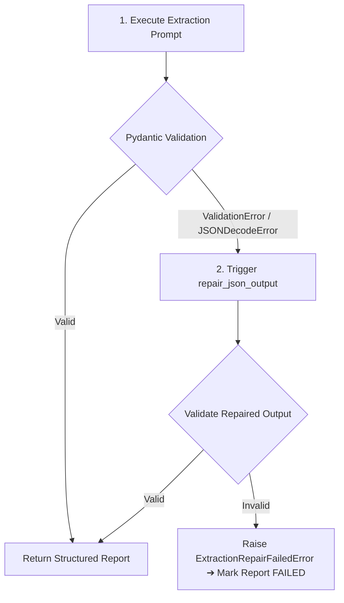

# AI / ML Pipeline Design & Safety Architecture

This document details the machine learning design, prompt architecture, structured schema enforcement, deterministic safety cross-checking, self-healing JSON repair, and failure propagation strategies implemented in the **AI Clinical Document Reviewer**.

---

## 🤖 1. Foundation Models & Runtime Configuration

The platform utilizes **Google Gemini 2.5 Flash** (`gemini-2.5-flash`) via the official `google-genai` SDK:
- **Temperature for Extraction**: `0.1` (Minimizes hallucination, optimizes deterministic structured extraction fidelity).
- **Temperature for Narrative Synthesis**: `0.2` (Provides natural medical narrative prose while strictly adhering to extracted clinical facts).
- **Structured JSON Mode**: `response_mime_type="application/json"` with schema passing via `response_schema=StructuredClinicalReport`.
- **Multimodal Vision Ingestion**: Directly ingests rendered PIL Image streams for single medical photos and rendered PDF pages.
- **Offline Heuristic Mode**: Implemented in [`GeminiClient`](backend/app/services/gemini_client.py#L117) to provide deterministic regex/rule-based NLP extraction when running offline or in environments without an API key.

---

## 📄 2. Extraction Pipeline per Input Type



### A. Plain Text Notes (`InputType.TEXT`)
- Extracted directly from request body.
- Normalized and passed immediately into the quality verification layer.

### B. Digital PDFs (`InputType.PDF`)
- Processed via [`extract_pdf_content`](backend/app/services/pdf_extractor.py#L12) using PyMuPDF (`fitz.open`).
- Iterates over all document pages, extracting character streams with layout preservation.
- Digital protocols with rich text (> 50 characters) are passed directly to the structured extraction pipeline.

### C. Scanned & Low-Density PDFs (`is_scanned = True`)
- When total extracted text across all pages is under `settings.MIN_PDF_TEXT_LENGTH_THRESHOLD` (50 characters), the document is classified as a scanned image PDF.
- The pipeline renders each page into a 150 DPI PNG image using `page.get_pixmap(dpi=150)`.
- Rendered images are saved to disk and routed to [`process_rendered_pdf_pages_vision`](backend/app/services/vision_pipeline.py#L27).

### D. Medical Images (`InputType.IMAGE`)
- JPG and PNG imagery (e.g. pathology scans, lab sheets) are verified for file integrity and passed to [`process_image_vision_pipeline`](backend/app/services/vision_pipeline.py#L8).

---

## 📐 3. Structured Output Enforcement

Structured outputs are enforced using **Pydantic v2** schemas defined in [`backend/app/schemas/clinical_report.py`](backend/app/schemas/clinical_report.py):

```python
class StructuredClinicalReport(BaseModel):
    patient_information: PatientInformation
    symptoms: List[str]
    diagnoses: List[str]
    medications: List[MedicationItem]
    vitals: Vitals
    allergies: List[AllergyItem]
    clinical_observations: List[str]
    clinical_concerns: List[str]
    missing_information: List[str]
    potential_inconsistencies: List[str]
    requires_review: bool
```

### Why Strict JSON Schemas Over Free-Text Prompting?
1. **Type Safety & Predictable Serialization**: Downstream database columns (`JSONB`) and frontend UI components depend on predictable object hierarchies.
2. **Schema Invariant Checking**: Enforces that nested sub-objects (`vitals.blood_pressure`, `medications[i].dosage`, `allergies[i].substance`) are strongly typed rather than unstructured text blobs.

---

## 🔍 4. Detection of Missing Information & Inconsistencies

To ensure patient safety, the system combines **LLM Semantic Scrutiny** with a **Deterministic Python Safety Engine** ([`_cross_validate_and_enrich_flags`](backend/app/services/clinical_extractor.py#L70)):

### A. Drug-Allergy Contraindication Rule Map
The safety engine cross-checks all extracted medications against documented allergies using a normalized contraindication map ([`ALLERGY_MEDICATION_CONFLICT_MAP`](backend/app/services/clinical_extractor.py#L25)):

```python
ALLERGY_MEDICATION_CONFLICT_MAP = {
    "penicillin": ["amoxicillin", "ampicillin", "augmentin", "penicillin", "piperacillin", "oxacillin"],
    "sulfa": ["bactrim", "sulfamethoxazole", "trimethoprim-sulfamethoxazole", "septra", "sulfasalazine"],
    "nsaid": ["ibuprofen", "naproxen", "aspirin", "ketorolac", "meloxicam", "indomethacin"],
    "aspirin": ["aspirin", "ibuprofen", "naproxen", "ketorolac"],
    "codeine": ["codeine", "morphine", "hydrocodone", "oxycodone"],
}
```

If a patient with a documented Penicillin allergy is prescribed Amoxicillin:
1. An explicit warning is appended to `potential_inconsistencies`:
   > `"CRITICAL CONTRAINDICATION: Documented allergy to 'Penicillin' conflicts with prescribed medication 'Amoxicillin'."`
2. `requires_review` is forced to `True`.
3. The UI prominently displays a red alert banner.

### B. Missing Critical Parameter Detection
The safety engine inspects extracted models for absent fields:
- **Demographics**: If neither `age` nor `dob` is present ➔ `"Missing critical patient demographic: Age or Date of Birth not documented."`
- **Medication Completeness**: If any medication lacks `dosage` ➔ `"Missing dosage specification for prescribed medication 'MedName'."`
- **Vital Signs in Symptomatic Patients**: If patient has acute symptoms but zero vitals (no BP, HR, Temp, SpO2) ➔ `"Missing physiological vital signs for clinical encounter."`
- **Enforcement**: Any entry in `missing_information` automatically flips `requires_review = True`.

---

## ✍️ 5. Dedicated Narrative Summary Generation

Instead of truncating the extracted JSON (which leads to disjointed clinical notes), the pipeline invokes a **second-stage dedicated prompt** ([`generate_clinical_summary`](backend/app/services/clinical_extractor.py#L202)):

```
SOURCE DOCUMENT:
{text}

STRUCTURED CLINICAL FINDINGS:
{structured_report.model_dump_json()}

INSTRUCTIONS:
Write a clear, narrative clinical summary (2-4 paragraphs) synthesizing:
1. Patient presentation, demographics, and primary reason for visit.
2. Core diagnoses, key clinical observations, and therapeutic plan.
3. Specific attention to flagged contraindications, missing critical data, and urgent concerns.
Do NOT just dump or truncate JSON.
```

This ensures the narrative summary reads like a senior physician's clinical handoff note.

---

## 🔁 6. Self-Healing JSON Repair Loop

If the LLM returns invalid JSON syntax or fails Pydantic schema validation:



The repair prompt feeds the LLM:
1. The **exact Pydantic validation error string**.
2. The **malformed raw output**.
3. The **original clinical document text**.
4. Instructions to fix formatting and return only a compliant JSON object.

---

## 🛡️ 7. Document Quality Guardrails & Failure Propagation

### A. Quality Guardrail ([`check_document_quality`](backend/app/services/clinical_extractor.py#L31))
Prevents processing non-clinical or corrupt inputs:
- Rejects empty strings, whitespace-only notes, or strings < 15 characters.
- Rejects non-alphanumeric noise (e.g. `"!@#$%^&*()_+"`).
- Rejects single repeating non-word tokens.
- Raises [`DocumentQualityError`](backend/app/core/exceptions.py#L9) with message:
  > *"Document quality is too poor or lacks readable clinical content to perform clinical review."*

### B. Failure Propagation to the User
- Exceptions in background tasks catch domain errors, update the database row to `status = ReportStatus.FAILED`, and record the clean `error_message`.
- When the user views [`ReportDetailPage.tsx`](frontend/src/pages/ReportDetailPage.tsx), a dedicated red error alert card renders the exact reason for the failure (e.g., *Document quality too poor* or *Unsupported file type*) **without rendering a blank screen or leaking raw stack traces**.
