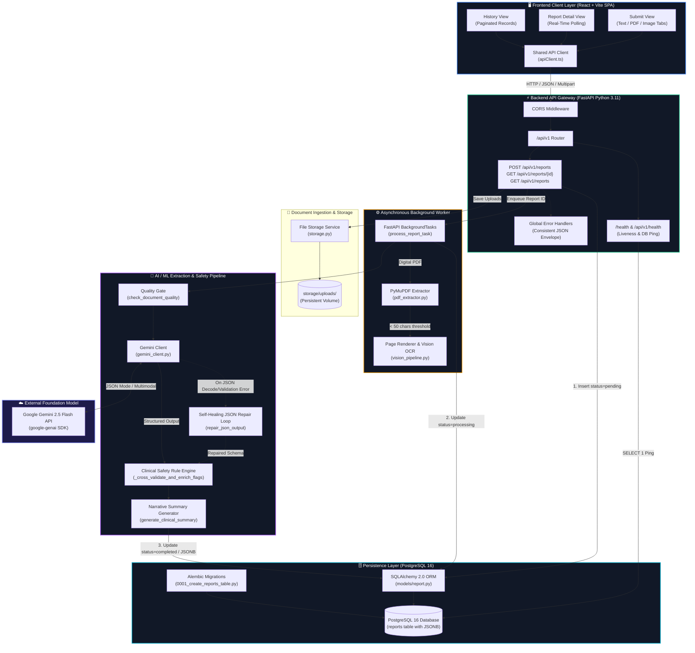
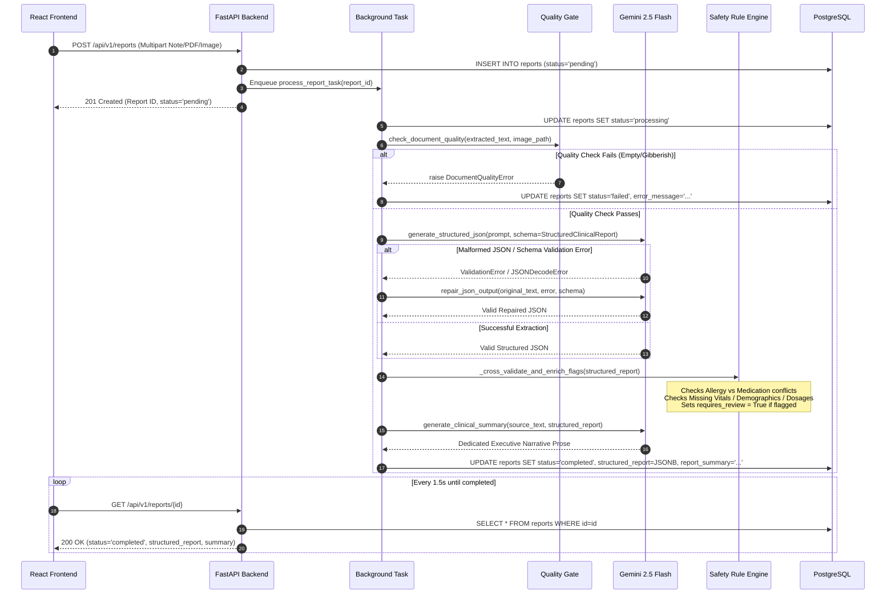

# System Architecture

This document provides a comprehensive technical overview of the **AI Clinical Document Reviewer** architecture, detailing data flow, system boundaries, asynchronous background processing, structured schema enforcement, and cloud deployment topology.

---

## 🏗️ End-to-End Architecture Diagram

---

## 🔄 Component Breakdown & Data Flow

### 1. Client Layer ([`frontend/src`](frontend/src))
- **`SubmitPage.tsx`**: Provides multi-modal tabs for raw clinical notes, PDF protocols, and medical scans/images. Preloaded with quick sample notes demonstrating *clean*, *sparse*, and *contradictory* encounters.
- **`apiClient.ts`**: Centralized HTTP client wrapping `fetch` with automatic `FormData` detection, configurable base URL (`VITE_API_BASE_URL`), and standardized parsing of the `{ success: false, error: { code, message } }` envelope.
- **`ReportDetailPage.tsx`**: Mounts with an automatic 1.5-second polling timer (`fetchReport`) that checks report status (`pending` ➔ `processing` ➔ `completed`/`failed`) until termination. Renders structured accordion cards and prominent warning banners without displaying raw JSON.
- **`HistoryPage.tsx`**: Paginated table listing past clinical reviews sorted with newest first, displaying type badges, timestamp, contraindication warning tags, and one-click inspection.

---

### 2. API & Routing Layer ([`backend/app/api/v1`](backend/app/api/v1))
- **`reports.py`**:
  - `POST /api/v1/reports`: Validates multipart inputs, rejects unsupported extensions or empty requests with HTTP 400, persists a new row in PostgreSQL with `status=pending`, and dispatches the background extraction job.
  - `GET /api/v1/reports/{report_id}`: Retrieves single report with structured clinical findings and executive narrative summary.
  - `GET /api/v1/reports`: Retrieves paginated reports ordered by `created_at DESC, id DESC`.
- **`health.py` & `main.py`**:
  - Direct root probe `GET /health` and versioned probe `GET /api/v1/health` executing active `SELECT 1` database query pings for cloud orchestrator liveness checks (Render, Railway, Kubernetes, Docker).
- **`error_handlers.py`**:
  - Global exception interceptors for `StarletteHTTPException`, `RequestValidationError`, `DocumentQualityError`, `ClinicalProcessingError`, and generic `Exception`.
  - Guarantees that **zero raw stack traces** or internal exception class names are returned to clients.

---

### 3. Asynchronous Worker & Ingestion Layer ([`backend/app/services`](backend/app/services))
- **`report_processor.py` (`process_report_task`)**:
  - Runs in the background decoupled from the HTTP response cycle.
  - Transitions report status from `pending` ➔ `processing` ➔ `completed` (or `failed`).
- **`pdf_extractor.py` (`extract_pdf_content`)**:
  - Opens PDF streams with PyMuPDF (`fitz.open`).
  - Measures total character length across all pages.
  - If text density < `settings.MIN_PDF_TEXT_LENGTH_THRESHOLD` (50 chars), classifies document as a scanned/image PDF, renders each page to a 150 DPI PNG, and routes to vision OCR.
- **`storage.py` (`save_upload_file`)**:
  - Sanitizes filenames and persists files into `storage/uploads/` with UUID prefixes.

---

## 🧠 AI / ML Pipeline Lifecycle

The AI/ML extraction layer operates in 4 sequential stages:

---

## 🗄️ Database Schema & Persistence

The PostgreSQL database schema is managed via Alembic revision [`0001_create_reports_table.py`](backend/alembic/versions/0001_create_reports_table.py):

| Column | Type | Description | Index |
|---|---|---|---|
| `id` | `INTEGER` (SERIAL) | Primary Key Autoincrement | Primary Index (`ix_reports_id`) |
| `created_at` | `TIMESTAMP WITH TIME ZONE` | UTC record creation timestamp | B-Tree Index (`ix_reports_created_at`) |
| `status` | `VARCHAR(50)` | Enum: `pending`, `processing`, `completed`, `failed` | B-Tree Index (`ix_reports_status`) |
| `input_type` | `VARCHAR(50)` | Enum: `text`, `image`, `pdf` | B-Tree Index (`ix_reports_input_type`) |
| `raw_input_ref` | `TEXT` | Raw text payload or file system storage path | — |
| `extracted_text` | `TEXT` | Extracted plain text or PyMuPDF / Vision OCR output | — |
| `report_summary` | `TEXT` | Dedicated executive narrative summary | — |
| `structured_report` | `JSONB` | Structured clinical schema (demographics, vitals, meds, flags) | — |
| `error_message` | `TEXT` | Nullable error explanation for failed runs | — |

---

## 🌐 Deployment Topology

- **Docker Compose**:
  - `clinical_reviewer_postgres` (Port 5432) with persistent volume `postgres_data:/var/lib/postgresql/data`.
  - `clinical_reviewer_backend` (Port 8000) running multi-stage Python 3.11 with automatic Alembic migrations on startup.
  - `clinical_reviewer_frontend` (Port 3000) served by Nginx Alpine with SPA routing.
- **Render / Railway (Backend & DB)**:
  - Docker container running `entrypoint.sh` binding dynamically to `$PORT`.
  - Connected to Managed PostgreSQL via `DATABASE_URL`.
  - Healthcheck monitored at `/health`.
- **Vercel (Frontend SPA)**:
  - Deployed as static edge bundle with client-side SPA routing rewrites configured via `vercel.json`.
